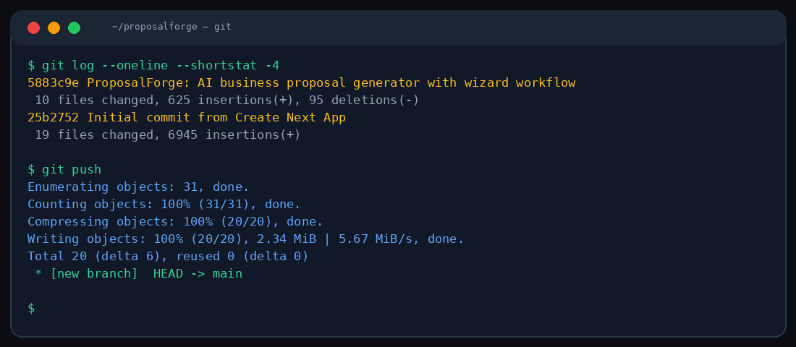

# 📋 ProposalForge

> Turn a project idea into a polished business proposal. ProposalForge generates structured proposals with executive summaries, timelines, budgets, and deliverables — all powered by AI.



---

## How it works

Describe your project in a few sentences. ProposalForge generates a complete proposal document including:

- **Executive Summary** — High-level project overview
- **Problem Statement** — What challenge are we solving?
- **Proposed Solution** — Technical approach and architecture
- **Timeline** — Phase-by-phase delivery schedule
- **Budget Estimate** — Cost breakdown by phase
- **Deliverables** — Concrete outputs and milestones
- **Risk Assessment** — Potential challenges and mitigations

## Quick Start

```bash
npm install
npm run dev
# → http://localhost:3000
```

## Configuration

```env
MIMO_API_URL=http://localhost:19911/v1/chat/completions
MIMO_API_KEY=your_key_here
```

## Tech Stack

- **Framework:** Next.js 16 with App Router
- **Styling:** Tailwind CSS 4
- **Language:** TypeScript
- **AI:** MiMo v2.5 Pro by Xiaomi

## Project Structure

```
src/
└── app/
    ├── api/generate/route.ts    # Proposal generation API
    ├── page.tsx                 # Form + preview layout
    ├── globals.css              # Slate/blue professional theme
    └── layout.tsx               # Root layout
```

## Design Language

Professional and clean. Slate grays with blue accent (#3b82f6). Card-based layout with subtle borders. Designed to feel like a SaaS productivity tool, not a demo project.

---

## MiMo v2.5 Pro

ProposalForge is powered by **[MiMo v2.5 Pro](https://huggingface.co/XiaomiMiMo)**, Xiaomi's reasoning-optimized language model. MiMo excels at structured long-form generation, making it ideal for business documents.

> *"Crafted with MiMo v2.5 Pro"*

---

**License:** MIT
